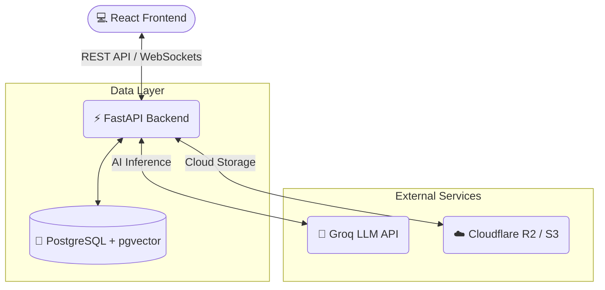

<div align="center">

# 🌟 Intellcamp 🌟

*An intelligent, full-stack educational platform powered by AI.*

[](https://reactjs.org/)
[](https://fastapi.tiangolo.com/)
[](https://www.python.org/)
[](https://www.postgresql.org/)


</div>

---

## 🚀 Overview
**Intellcamp** is a cutting-edge web application blending a lightning-fast React frontend with a robust FastAPI backend. It leverages the power of AI (via Groq), vector databases, and scalable cloud storage to deliver a seamless learning experience.

---

## 🏗️ Architecture



---

## 🛠️ Prerequisites

Before you begin, ensure you have the following installed:

<details>
<summary><b>🐍 Backend Requirements (Click to Expand)</b></summary>
<br>

- **Python 3.10+** (3.12 recommended)
- **PostgreSQL** (with `pgvector` extension)

- Core dependencies: `fastapi`, `uvicorn`, `sqlalchemy`, `psycopg2-binary`, `pgvector`
- Security & Utilities: `pyjwt`, `bcrypt`, `python-multipart`, `python-dotenv`
- File Processing: `pymupdf`, `sentence-transformers`, `boto3`
</details>

<details>
<summary><b>⚛️ Frontend Requirements (Click to Expand)</b></summary>
<br>

- **Node.js** (v18+)
- **npm** or **yarn**
- Core: `react`, `react-router-dom`
- UI & Styling: `tailwindcss`, `framer-motion`, `lucide-react`, `recharts`
</details>

---

## ⚙️ Quick Start

### 1️⃣ Database Setup
Ensure your **PostgreSQL** server is running and create a new database (e.g., `majorproject`).

### 2️⃣ Environment Variables
Create a `.env` file in the `backend/` directory using this template:

```env
# 🐘 Database Configuration
DATABASE_URL=postgresql://<user>:<password>@localhost/<db_name>

# 🔐 Security
SECRET_KEY=your_super_secret_key_here

# ☁️ Cloud Storage (Cloudflare R2/S3)
R2_BUCKET_NAME=your-bucket-name
R2_ACCESS_KEY_ID=your_access_key
R2_SECRET_ACCESS_KEY=your_secret_access_key
R2_ENDPOINT_URL=https://your-endpoint.r2.cloudflarestorage.com

# 🧠 AI / LLM Integration
GROQ_API_KEY=your_groq_api_key_here
```

### 3️⃣ Fire it up! 🔥

**Starting the Backend:**
```bash
cd backend
pip install -r requirements.txt
uvicorn app.main:app --reload
```
*API docs available at: http://localhost:8000/docs*

**Starting the Frontend:**
```bash
cd frontend
npm install
npm run dev
```
*App available at: http://localhost:5173*

---

<div align="center">
  <i>Built with ❤️ for the future of education.</i>
</div>