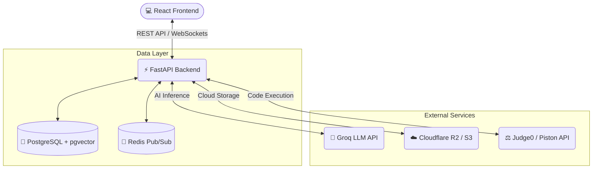

<div align="center">

# 🌟 Intellcamp 🌟

*An intelligent, full-stack educational platform powered by AI.*

[](https://reactjs.org/)
[](https://fastapi.tiangolo.com/)
[](https://www.python.org/)
[](https://www.postgresql.org/)
[](https://tailwindcss.com/)

</div>

---

## 🚀 Overview
**Intellcamp** is a cutting-edge web application blending a lightning-fast React frontend with a robust FastAPI backend. Designed to revolutionize the modern classroom, it leverages the power of AI (via Groq), WebSockets for real-time collaboration, and scalable cloud storage to deliver a seamless learning experience for students, teachers, and enterprise administrators.

---

## 🏗️ Architecture



---

## 🛠️ Tech Stack

### Frontend
- **Framework:** React.js (v18) with React Router
- **Styling:** Tailwind CSS, Framer Motion (Animations)
- **Icons & Charts:** Lucide React, Recharts
- **Code Editor:** Monaco Editor (`@monaco-editor/react`)

### Backend
- **Framework:** FastAPI, Uvicorn
- **Database:** PostgreSQL (with `pgvector` for semantic search), SQLAlchemy ORM
- **Authentication:** PyJWT, bcrypt, python-multipart
- **Real-Time:** WebSockets, Redis (Pub/Sub for scaling)
- **File Processing:** PyMuPDF, sentence-transformers, boto3

---

## ⚙️ Quick Start

### 1️⃣ Database Setup
Ensure your **PostgreSQL** server is running and create a new database (e.g., `majorproject`). Ensure **Redis** is running locally for WebSocket Pub/Sub.

### 2️⃣ Environment Variables
Create a `.env` file in the `backend/` directory using this template:

```env
# 🐘 Database Configuration
DATABASE_URL=postgresql://<user>:<password>@localhost/<db_name>

# 🔴 Redis Configuration
REDIS_URL=redis://localhost:6379

# 🔐 Security
SECRET_KEY=your_super_secret_key_here

# ☁️ Cloud Storage (Cloudflare R2/S3)
R2_BUCKET_NAME=your-bucket-name
R2_ACCESS_KEY_ID=your_access_key
R2_SECRET_ACCESS_KEY=your_secret_access_key
R2_ENDPOINT_URL=https://your-endpoint.r2.cloudflarestorage.com

# 🧠 AI / LLM Integration
GROQ_API_KEY=your_groq_api_key_here
```

### 3️⃣ Fire it up! 🔥

**Starting the Backend:**
```bash
cd backend
pip install -r requirements.txt
uvicorn app.main:app --reload
```
*API docs available at: http://localhost:8000/docs*

**Starting the Frontend:**
```bash
cd frontend
npm install
npm run dev
```
*App available at: http://localhost:5173*

---

<div align="center">
  <i>Built with ❤️ for the future of education.</i>
</div>